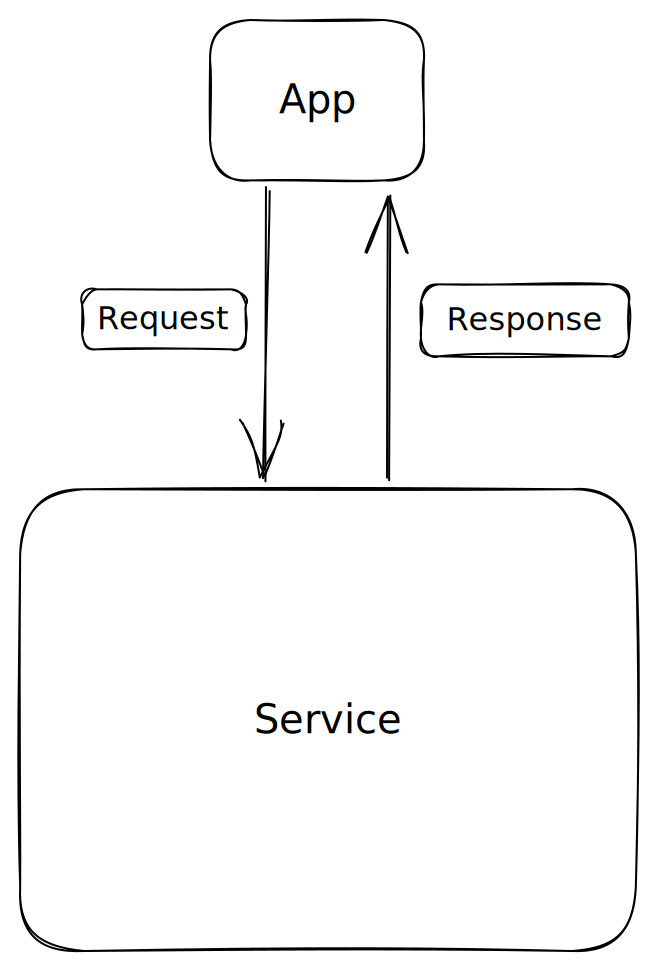

# gridql
Scaffolding for converting event documents into a mesh

GraphQL has a [Conway's Law](https://en.wikipedia.org/wiki/Conway%27s_law) problem: its built by a company that has lots of smaller business units that are controlled, synchronised and presetend by a single umbrella company [Meta](https://about.meta.com). So they solved the distributed nature of GraphQL with a single point of failure [Apollo](https://www.apollographql.com/). 

Apollo has lots of advantages if you didn't start with GraphQL in mind. It does an excellent job presenting ReST and RPC API as GraphQL. So you can quickly experiement with graph design if you're new to the concept. It also 'enhances' your graph with conventional queiry tools that make the api look more like SQL giving your filters and pagination out of the box. But if you've ever built a distributed system you're probably asking questions like:

* How well does this perform?
* What happens when the gateway fails?
* How do the filters work?
* How does it handle dependent system failures?

And of course, it handles them as well as it can, given this architecture: poorly. 

Apollo is a developer tool that gets a poor-to-mid solution to market quickly. Because of that, its very attractive organisations that value time to market over performance. This trade off is nearly always the right solution.

But that's not why we're here. We want to do a native GraphQL solution. An actual GraphQL solution that is genuinely distributed, performant and fast to market. 

This is how you do it.

## Philosophy

At its simplest a server should try its hardest to look like this:

A nice [black box](https://en.wikipedia.org/wiki/Black_box) where the application is completely unaware of the complexities inside the service.

But that complexity continues to exist. 

* What requests should the service expose?
* What should the response format be?
* What happens if the service is down?

And those questions are complex enough when there is a single application. But what we're finding is that applications are really collections of people trying to get shit done, and not universal tools that can be used by everyone.

Even if the use cases are the same, the way people use the apps are unique and given enough users will eventually devolve to the point that multiple, distinct applications of the same data are inevitable.

We already acknowledge this in a lot of practices. We often talk about Roles and Responsibilities within an application.

<svg class="line-chart"></svg>

The above graph is trying to express the differences between where you think you're going and where you end up.

Ideally, you know all the features up front, its nice and simple and when you complete your feature set everyone is happy forever.

In reality, by the time you get to a 100 users you're already getting feature requests that you weren't expecting, by the time you hit 1000 you've doubled the expected amount of effort and by 100000 its out of control and you're concidering a re-write.

## To Do

* [X] Graph Nodes
* [X] ReST Server
* [X] Mongo Listener that publishes to kafka
* [X] Bulk ReST API
* [ ] Configurable ID on rest
* [ ] Time aware GraphAPI
* [x] Kafka Listener that pushes to ReST

## Coverage

