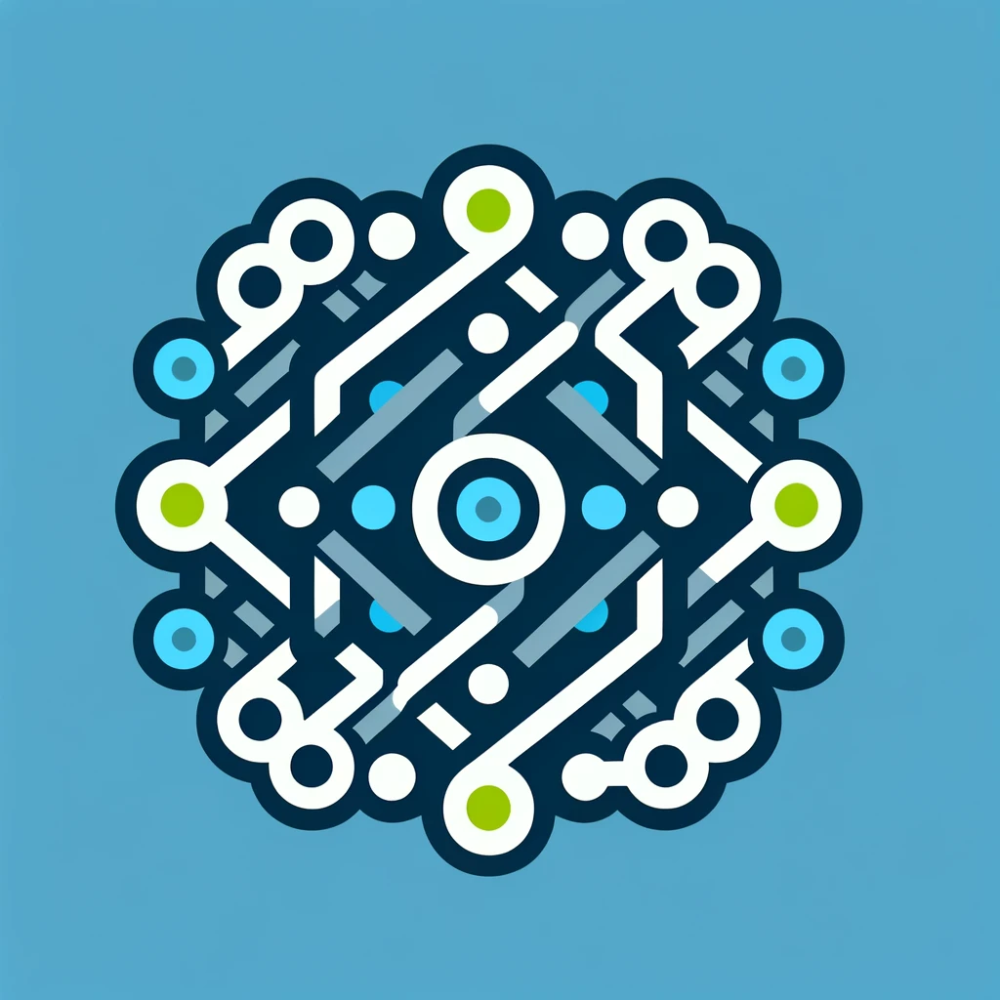

[](https://github.com/tsmarsh/gridql/actions/workflows/node.js.yml)
[](https://codecov.io/gh/tsmarsh/gridql)

# gridql




Like the idea of [Events Driven Architecture](https://aws.amazon.com/event-driven-architecture/) but you don't like the idea of building tens of dumb services that all do the same thing? 

Need to get a scalable, fast enough, data tier up and running in minutes? 

Tired of having to release each microservice on its own?

Like the idea of GraphQL because you don't have to build a BFF but hate mutations?

Like ReST, but don't like using it for queries?

We got you.

GridQL isn't your destination it's your starting point. Scaffolding, composed of a small, pre-canned set of opinions to start your journey towards building a modern(ish) platform.

## Components

### [Repository](packages/server/README.md)

The mesh is composed of Repositories. These follow the Repository pattern documented
by [Martin Fowler in Patterns of Enterprise Architecture](https://martinfowler.com/eaaCatalog/repository.html). The repository server two functions:


The premise is that we access data via a simple set of commands for state transfer:

* Create
* CreateMany
* Update
* UpdateMany
* Delete
* DeleteMany

and then access the data on the repository:

* Read
* List

and finally allow us to query

* getById
* getByX

As these repositories exist in the network and not in memory we instantly fall foul
of [CAP Theory](https://en.wikipedia.org/wiki/CAP_theorem) as we loose implicit control of state and expose ourselves to
the far more likely network faults.

We mititate this by splitting the problem into two, similar to the [CRQS](https://martinfowler.com/bliki/CQRS.html)
pattern.
Allowing us to scale commands and queries separately but, more importantly allowing us to use ReST for what it shines
at: Commands and GraphQL for what it excels at Queries.

#### Restlettes

Responsible for event recording. They own the model, and are the only component allowed to write to the data store. 

The provide a simple, and consistent way to store events. Simply define the swagger that describes the payload, and point them at a datastore.

You can use them for data retrieval, but just the state that you stored. No querying, no pulling data from other services.

#### Graphlettes

Responsible for turning a rag tag collection of restlettes and turning them into a mesh. 

Each graphlette presents the world with its own view of the data starting from the data in its restlette:

`N Restlettes == N Graphlettes`

The are the primary means for extracting data from the system.

#### Microliths

[Monoliths](https://en.wikipedia.org/wiki/Monolithic_application) get a bad wrap. Given enough time they tend towards [Big Ball of Mud](https://blog.codinghorror.com/the-big-ball-of-mud-and-other-architectural-disasters/) We like to talk about [S.O.L.I.D.](https://en.wikipedia.org/wiki/SOLID) 
and [Object Orientated Programming](https://en.wikipedia.org/wiki/Object-oriented_programming) as techniques to prevent this from happening, but the reality is that they, at best, delay this inevitability. The issue is less with how we build them, and more to do with how we use them. Success breeds more users, more users have more diverse demands, eventually the model on which the monolith is built breaks and the cost to make changes increases exponentially.

[Microservices](https://en.wikipedia.org/wiki/Microservices) go in the other direction by moving objects into network. Surprisingly, its much easier to follow S.O.L.I.D. principals by building a series of black box services that agree on a common way of sharing information. But microservices push the complexity into the service and network layer.  

We're taking a middle path. Composing monoliths with microservices.

We don't know your data or usage pattern. What we do know is that bundling multiple microservices in to a single service makes a lot of things easier.

Perfectly valid microliths:

* A server per graphlette and restlette: true microservice
* A single server with all graphlettes and restlettes: microlith
* All graphlettes in one server, all restlettes in another
* Low traffic xLettes in a microlith, high traffic xLettes in their own microservices. 

We don't know what makes sense for you, but we have made it as easy as possible to change your mind.

We'd heavily recommend starting out with everything in a single microlith, then using data to figure out the best way to break it apart... and if you're wrong, merge them back together.

### [Mongo Event Builder](packages/mongo-event-builder/README.md)

Its all very well having a means for an application to get data out of the system. But how can you inform other parts of the system that your data has changed?

Kafka, you use kafka.

This component attaches to your [Mongo Replica Set](https://www.mongodb.com/docs/manual/replication/) and creates light weight events on public topics. 

Other services are encouraged to consume those topics and then call the graph api to get the data they need to update their data.

#### Example

> Applications are only allowed to present data that is owner by the user they represent.

In a simple case, the `authorized_users` is simply the user that created the event, but its not unusual for resources to be access by groups of users of certain roles.

So if we have a `User` service an `Account` service and a `Group` service that describes the `Role` and a list of `User` in that `Group`.

All services maintain a list of `authorized_users` but how users get into that list is an exercise for the system. 

In this example, lets assume that we want all of the users in a group to be in the list of `authorized_users`.

To achieve this we create a consumer that listens to `Group`s topic, call the groups graph to figure out the current list of users, then modify the `Account`s `authorized_user` list. Of course we may choose to listen to multiple groups, or even multiple services.


### [Kafka Event Consumer](packages/kafka-event-consumer/README.md)

If an application needs to create an event, calling the restlettes makes the most sense. But what if the data is coming from inside of the enterprise?

In that instance we'd recommend creating an 'input topic' that keeps the data in same format as the restlette is expecting then using a `Kafka Event Consumer` to call the restlettes (single writer).

Only this component should read from the topic (it is private).

We don't know or care how events get into this topic, but we'd recommend something like:

```
System of Record => Change Data Capture => public topic => ksql => private topic => event consumer
```

## Core Concepts

### Modeling

#### Ownership

From the point of view of client applications, each repository owns the data and can be treated as a system of record.

It should be explicit which repository owns which data.
Think [3rd normal form](https://en.wikipedia.org/wiki/Third_normal_form) in RDBMS.

Complex objects are composed by meshing simple objects.

As we have learned from OO hierarchy can be an important tool, but is a tool of last resort. Composition is the only
mechanism supported by gridql.

#### Advocacy

It is rarely the case that a Repository is actually the system of record. In our applications, the majority of
the repositories mapped concepts owned by multiple external systems.

To that end it is the responsibility of the repository to mesh the demands of modern, transactional systems, with
whatever has been patched together in the enterprise be they: flat files, rdbms, excel documents, manual entry. 

#### Separation of Concerns and Awareness


* Clients must only be aware of the Ownership tier.
* Repositories are only aware of each other and the queue
* Advocates are aware of the queue, the Ownership tier and the Enterprise
  * But have really narrow purpose: create an event type, update a system of record
  * They are unaware of clients
* Enterprise applications are unaware of everything

### State
#### Idemptotency and Identification

As we are in a distributed multithreaded environment somethings that might be easy in a single threaded, monolithic solution become... interesting.

So we have three mechanisms of identification on a given object:

1. Canonical "id" this field is automatically added to new objects in its meta data. Its a guid that is used to represent an object throughout its lifecycle in the ownership tier.
2. The storage id "_id", also in metadata, but only used internally.
  * An updated object is a copy of the original with the same canonical id, but a different timestamp and _id
  * There can be N versions of an object in a timeseries.
3. Payload id. These live in the payload and are used to tie an object back to an external system. They cannot be called "id"


#### Time

Because a query might happen whilst a repository is updating its collection, queries between repositories all contain the time stamp of the originating request.

This allows two features:

1. Time travel: we can ask the system how it would have responded to the query at a given moment in the past
2. Queries are consistent with the state of the mesh at the time of the query.

#### Asynchronisity

The ownership tier is distributed and synchronous. All commands and queries are responded to immediately.

However, reporting true state is important.

If you accept a change on behalf of a system of record you have a responsibility to make that truth available to client applications. 

At least three patterns are effective here:

##### Hold state on the object

1. Client Application submits a payload
2. Repository emits an event
3. An event propagator picks that up and writes a new field to the payload or meta data saying "received"
4. Event propator propogates event to systems of record
5. Event generator sees change in systems of record and writes back new state to object "accepted"
6. Client application can query for new state

This mechanism is mostly useful when the object isn't part of a more complicated workflow.

##### One object per state

1. Client Application submits a payload
2. Repository emits an event
4. Event propator propogates event to systems of record
5. Event generator sees change in systems of record and creates an event that will generate a new object
6. Client application can query for new object

##### Workflow

1. Client Application submits a payload
2. Repository emits an event
4. Event propagator propagates event to systems of record
5. Workflow sees repository event and updates its state for the transaction
5. Event generator sees change in systems of record and creates an event that will generate a new object
6. Workflow sees repository event for new object and updates its state for the transaction
6. Client application can query the workflow for the state of the transaction and query appropriately

### Authorization

Each repository is responsible for its own authorization. A basic 'auth' is provided that uses the SID on a JWT token, but fine grained authz support is encouraged.


### Utilities

#### [Merminator](packages/merminator/README.md)

Dramatically reduces the complexity of generating the config.

**This is just a QoL thing. You should get used to the config, its where all the fun happens**

#### [Payload Generator](packages/payload-generator/README.md)

You went to the effort of creating json schema to describe your payloads... might as well use it to generate you test data.

#### [Payload Validator](packages/payload-generator/README.md)

Simple wrapper around json-schema to validate payloads. 

**You're probably better off using your own module.**

#### [Mongo Connector](packages/mongo-connector/README.md)

Mongo does an excellent job of retrying if a connection is lost, but out of the box it won't retry an initial connection. 

This is not a hard problem to solve, this is how we solved.

**You're probably better off using your own module.**

#### [Authorizer](packages/auth/README.md)

We have a couple of examples of how you might implement authorization. But really, we don't know how you need to authorize access to your data. 

There is a simple enough pattern to follow. Please feel free to contribute back any generic solutions.

**You're probably better off using your own module.**

## To Do

* [X] Graph Nodes
* [X] ReST Server
* [X] Mongo Listener that publishes to kafka
* [X] Bulk ReST API
* [X] Time aware GraphAPI
* [X] Auth
  * [X] ReST
  * [X] Graph
* [x] Kafka Listener that pushes to ReST

## Coverage


