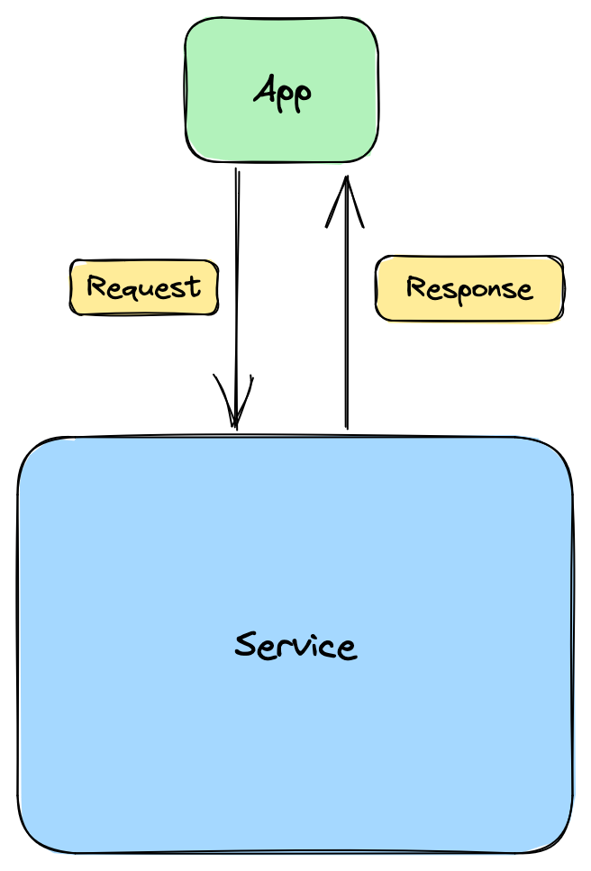
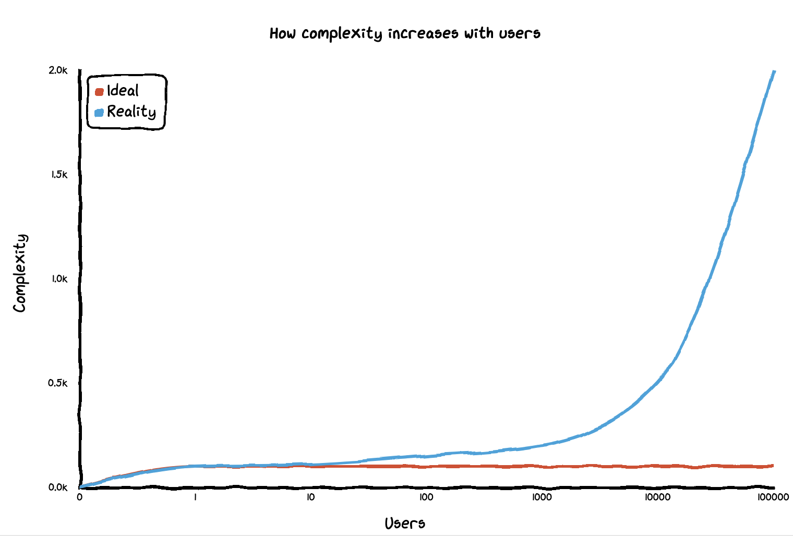

    ## Philosophy

At its simplest a server should try its hardest to look like this:

A nice [black box](https://en.wikipedia.org/wiki/Black_box) where the application is completely unaware of the complexities inside the service.

But that complexity continues to exist.

* What requests should the service expose?
* What should the response format be?
* What happens if the service is down?

And those questions are complex enough when there is a single application. But what we're finding is that applications are really collections of people trying to get shit done, and not universal tools that can be used by everyone.

Even if the use cases are the same, the way people use the apps are unique and given enough users will eventually devolve to the point that multiple, distinct applications of the same data are inevitable.

We already acknowledge this in a lot of practices. We often talk about Roles and Responsibilities within an application.

The above graph is trying to express the differences between where you think you're going and where you end up.

Ideally, you know all the features up front, its nice and simple and when you complete your feature set everyone is happy forever.

In reality, by the time you get to a 100 users you're already getting feature requests that you weren't expecting, by the time you hit 1000 you've doubled the expected amount of effort and by 100000 its out of control and you're concidering a re-write.

Of course, this problem isn't unique to software. It happens across all products.

> You can please some of the people all of the time, you can please all of the people some of the time, but you can’t please all of the people all of the time -- [John Lydgate](https://en.wikipedia.org/wiki/John_Lydgate)

### So where does that leave us?

1. Stop assuming we know how people are going to consume our data.

2. Focus on the interactions with our system that affect the data, not the data itself.

3. Stop assuming that each interaction can only result in a single, predictable and enduring outcome.

4. State is a function of time and data, not data alone.
