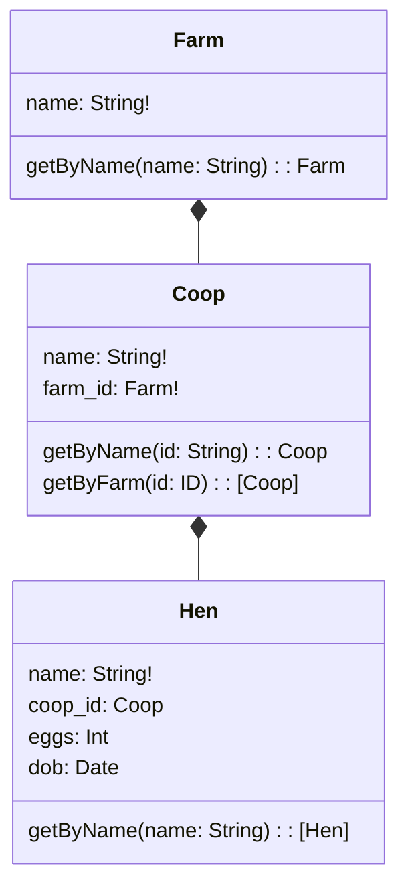

# Merminator

[tl;dr;](#usage)

When you have a collection of small things that don't need each other but cooperate indirectly, what we're doing pushing complexity into configuration.

This complexity is a property of the problem not of the solution, it has to exist somewhere.

In monoliths we hide it in code. The view must match the controller, must match the model, must match the database, must match the api call.
Because its hidden we can get away with breaking rules that we wouldn't admit to and we end up with a ball of mud.

We can mitigate with code review and testing. But tools like type checking, if done lazily, can compound the issue by locking otherwise unrelated features into a common model.

But mitigation is different from solving.

## The Problem

In GridQL we can quickly generate a lot of small things that need to cooperate.

- ReSTLettes and Graphlettes share a model in the same Repostitory
- Graphlettes propagate queries to their nearest Neighbours (so need to know how to propagate)
- Graphlettes have their own schema which shares views of types across the mesh
- ReSTLettes and Graphlettes share storage

The complexity of this task grows exponentially with the number of Repositories. But fortunately for us, its a piece of cake for a computer.

### Restlettes


Restlettes need two primary configurations:

- What they're storing (JSONSchema)
- Where they're storing it (MongoConfig)

### Graphlettes


Graphlettes require a bit more configuration.

- Where to find the root record (MongoConfig)
- What queries to run for each graphql querie
- How to resolve data that is from another repository
- How to present the available mesh (GraphQL Schema)

### A Single Repository Server

So far so good. In fact for a single repository server


You only need three configuration files:

- The JSONSchema
- The GraphQL Schema
- A configuration file that details
  - The queries
  - The resolvers
  - The mongo connection

The 'simple' test cases in [server](../server/test) show how easy this is to configure.

But we still need to ensure that:

- types in the jsonschema are compatible with graphql schema
  - Otherwise queries will fail
- The restlette and graphlettes are pointed at the same collection in the same database
  - Otherwise changes in the restlette will not be queriable
- The queries are configured correctly and match the schema
  - Otherwise queries will throw errors
  - return the wrong data

There is very little opportunity for forgiveness here. We have loose objects that need to be linked together.

Much like dynamic programming.

### Multiple Repository Servers


We can take the option above and simple create a bunch of them. In this configuration each server needs its own configuration.

This was the 'simplest thing that will work' for early applications that used this pattern.

The mesh was formed by calling out across a load balancer.

This obviously scales well, albeit at the cost of a lb network call instead of a localhost call, but its server costs and deployment complexities can't be ignored.

Think about the number of repositories in a conventional application. In this configuration that would be a deployment per object. Its also a testing nightmare. Any benefits you might achieve by being able to only release the servers than have changed are squashed by the complexity of proving that 'Farm v3' is compatible with 'Coop v1'


The above example is typical in a micro-service architecture.

There is no evidence that Farm v3 works with Coop v1 before it hits production. The responsible thing is to hold back a release of Farm v3 until Coop v2 is in production, or release them together... so do you really have the ability deploy components independently?

The answer to that is between you and your risk register.

### A Multi Repository Server


GridQL enables you to configure a single server to serve multiple repositories.

Mesh calls are handled over localhost so are _almost_ as fast as a method call.

You can still scale the servers horizontally. You can even partition the servers, by using different databases for partition / url strategies that work for your domain.

Beyond the cost savings and performance enhancements we get a similar testing story to a monolith.

But... we're forced to shift left on configuration.


The complexity of the configuration doesn't change, we're just forced to think about it earlier.

## Usage

### Disclaimer :-)

There is absolutely no requirement to use Merminator to configure your project. In fact, the best analogy I've seen so far is that, at best, its like Rails Scaffolding.

Out of the box Merminator takes a cleverly composed [Mermaid Class Diagram](https://mermaid.js.org/syntax/classDiagram.html) and converts it into a set of configuration for a GridQL Server.

You can see an example of this magic in the [test suite](test/the_farm.spec.js)

### Writing your own



#### classDiagram

Required by mermaid so it knows how to render

#### Depends on

Syntax: `Farm *-- Coop`

Only this relationship is supported at the moment.

It tells merminator that `Coop` depends on `Farm`, it will then add the field `coops` to the GraphQLScheme and create a `resolver` in the server config that uses `getByFarm` on `Coop` to resolve the reverseLookUp.

At the current version, you need to add `getByFarm` as to the Mermaid otherwise you will get errors.

#### Fields

Syntax `name: String!`

The order, `Identifier Colon Type` is important to Merminator, it is not important to Mermaid.

The fields are added to GraphQL, and JSONSchema.

Use GraphQLTypes and merminator will convert them to JSONSchema Types.

It also sets up the DTOFactory Configuration for the server.

Types ending with a `!` are 'required' and added to `requiredTypes` on the JSONSchema document.

##### Conventions

`coop_id: ID` indicates that the coop_id field is a reference to an object in another repository.

`coops: [Coop]` would indicate to merminator that coops are stored on the hen. Whilst this works, it would be considered a [smell](https://en.wikipedia.org/wiki/Code_smell).

#### Queries

Syntax `getById(id: ID): Hen`

Again, we use graphql conventions here (as the queries are really only relent the graphlettes).

`!` on the type arguments means that they are required.

A optional argument of `at: Float` is added to every query so that the state / time constraints of GraphQL can be resolved.

#### Conventions

```
Coop *-- Hen
class Hen {
    name: String!
    coop_id: Coop
    eggs: Int
    dob: Date

    getByName(name: String): [Hen]
    getByCoop(id: ID): [Hen]
}
```

In this example coop_id and the `Coop *-- Hen` relationship that `getByCoop(id: ID): [Hen]` is required, however, it currently isn't added by merminator.

`getByName` will automatically create a lookup based on the field 'name', if 'name' isn't a field you will currently get an error.
